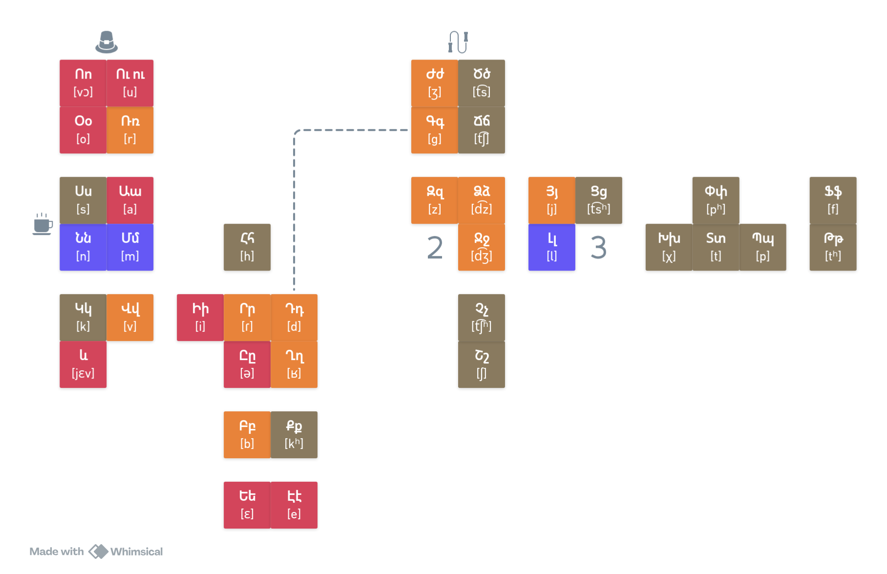
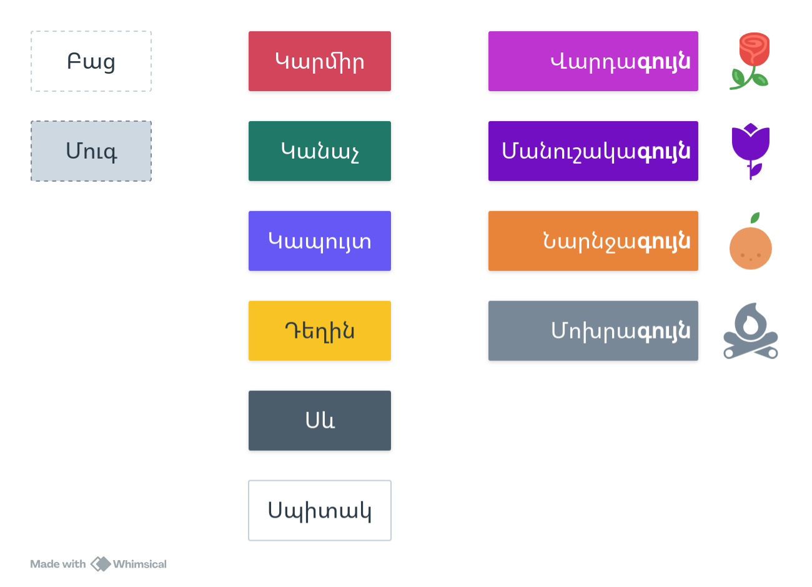

# 🇦🇲 Armenian

## 🔤 Alphabet

## 🌈 Colors

## 🗣️ Pronouns

=== "🗣️ Personal"
    <table>
        <thead>
            <tr>
                <th></th>
                <th>👤 Singular</th>
                <th>👥 Plural</th>
            </tr>
        </thead>
        <tbody>
            <tr class="person-first">
                <th>1st</th>
                <td>🙋 ես [jɛs]</td>
                <td>🙋🙋 մենք [mɛnkʰ]</td>
            </tr>
            <tr class="person-second">
                <th>2nd</th>
                <td>👤 դու [du]</td>
                <td>👥 դուք [dukʰ]</td>
            </tr>
            <tr class="person-third">
                <th>3rd</th>
                <td>🧑 նա [nɑ]</td>
                <td>🧑🧑 նրանք [nrɑnkʰ]</td>
            </tr>
        </tbody>
    </table>

=== "🏷️ Possessive"
    <table>
        <thead>
            <tr>
                <th></th>
                <th>👤 Singular</th>
                <th>👥 Plural</th>
            </tr>
        </thead>
        <tbody>
            <tr class="person-first">
                <th>1st</th>
                <td>🙋 իմ [im]</td>
                <td>🙋🙋 մեր [mɛɾ]</td>
            </tr>
            <tr class="person-second">
                <th>2nd</th>
                <td>👤 քո [kʰɔ]</td>
                <td>👥 ձեր [dzɛɾ]</td>
            </tr>
            <tr class="person-third">
                <th>3rd</th>
                <td>🧑 նրա [nɑɾɑ]</td>
                <td>🧑🧑 նրանց [nrɑntsʰ]</td>
            </tr>
        </tbody>
    </table>
