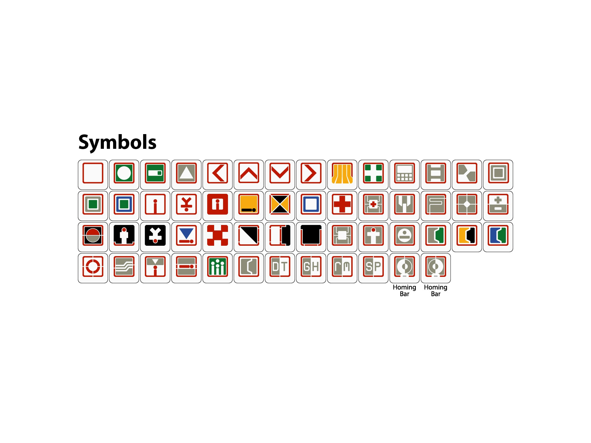

{{ page.meta.description }}

## Why a pad

One machine does the typing; another runs an agent you can see on a shared monitor.
A KVM lets you glance at that second screen, but you often do not want a full keyboard plugged into it.
A small programmable macro pad is enough if it can send the few chords and sequences you actually use to steer, approve, stop, and exit.

This post is that **agentic keypad**: personal high-frequency controls across Cursor, Claude Code, and Codex on **Linux**, mapped onto an **Ortholinear** pad with **uni-profile [Semiotic Standard](https://spkeyboards.com/products/g20-semiotic-keycaps)** legends.
The pad is one-handed and never asks you to hold a modifier chord — macros may *emit* chords, but every physical key is a single press.

## Decisions

- **Ortholinear (all 1u).** No pad-side key combinations means no need for 1.25u / 1.5u Shift or Ctrl blanks; stock pads with odd key widths make legend matching painful.
- **Uni-profile keycaps.** Row-sculpted profiles (e.g. Cherry) lock which legend can sit in which row. Uni-profile sets — [G20](https://spkeyboards.com/products/g20-semiotic-keycaps), [XDA](https://keebdepot.com/guides/keycap-profiles-compared), [DSA](https://keebdepot.com/guides/keycap-profiles-compared) — keep every key the same shape so layout stays free.
- **Semiotic Standard only.** One legend vocabulary ([G20 Semiotic](https://spkeyboards.com/products/g20-semiotic-keycaps)); every other keycap set is out of scope.
- **Mode cycle = one key.** Using an encoder to spam ++shift+tab++ both ways wastes an axis and misreads as continuous control. A dedicated pad key emits ++shift+tab++ instead; the encoder is free for zoom.

## Semiotic Standard keycaps

1u symbol sheet from [G20 Semiotic](https://spkeyboards.com/products/g20-semiotic-keycaps) (kits with wider caps omitted — Ortholinear pad uses 1u only). Click for the product page.

## Conventions

- Bindings are Linux defaults from current product docs (Cursor ++cmd++ → ++ctrl++).
- Chords use `+` inside one key span: ++ctrl+l++.
- Sequences of separate presses use `→`: ++slash++ → `plan` → ++enter++.
- Alternates in the Tools columns are separated by `;`.
- An empty cell means the action is not applicable or has no documented binding / keycap fit.
- Several rows are **cycles** (mode, approval), not single toggles — a pad key may need to send the chord more than once.
- **Knob/Wheel** marks analog pad controls: rotary encoder / scroll wheel (:material-knob:) for scroll and zoom, or joystick (:material-gamepad:) for selection.
- **Semiotic** is the only keycap legend set: [G20 Semiotic](https://spkeyboards.com/products/g20-semiotic-keycaps) (Zslane / Signature Plastics). Icons are Cobb Semiotic Standard vectors ([louh/semiotic-standard](https://github.com/louh/semiotic-standard), CC BY 4.0), linked to that product page.
- A green row with :white_check_mark: means that binding choice is **decided** (ADR-style).

## Actions

Tool columns link to each product’s shortcut docs. Identical bindings across tools share a cell.

<!-- md_in_html: every block tag needs markdown=; do not indent these tags -->
<table markdown="1">
<thead markdown="1">
<tr markdown="1">
<th markdown="1" rowspan="2">Action</th>
<th markdown="1" colspan="3">Tools</th>
<th markdown="1" colspan="2">Controls</th>
<th markdown="1" rowspan="2">Notes</th>
</tr>
<tr markdown="1">
<th markdown="1">[Cursor](https://cursor.com/docs/reference/keyboard-shortcuts)</th>
<th markdown="1">[Claude Code](https://code.claude.com/docs/en/interactive-mode)</th>
<th markdown="1">[Codex](https://developers.openai.com/codex/cli/slash-commands)</th>
<th markdown="1">Knob/Wheel</th>
<th markdown="1">[Semiotic](https://spkeyboards.com/products/g20-semiotic-keycaps)</th>
</tr>
</thead>
<tbody markdown="1">
<tr markdown="1" class="decided">
<td markdown="1">:white_check_mark: Scroll Content</td>
<td markdown="1" colspan="3"></td>
<td markdown="1">:material-knob:</td>
<td markdown="1"></td>
<td markdown="1">Mouse-wheel scrolling works in each agent. Map to a rotary encoder — too sensitive for a discrete keycap, so no Semiotic legend.</td>
</tr>
<tr markdown="1" class="decided">
<td markdown="1">:white_check_mark: Zoom in</td>
<td markdown="1" colspan="3">++ctrl+shift+"+"++</td>
<td markdown="1">:material-knob:</td>
<td markdown="1"></td>
<td markdown="1" rowspan="2">Terminal / agent-host zoom on one rotary: one direction emits ++ctrl+shift+"+"++, the other ++ctrl+shift+"-"++. Hosts may also honor plain ++ctrl+"+"++ / ++ctrl+"-"++; the pad sends the Shift variants. No Semiotic — knob only.</td>
</tr>
<tr markdown="1" class="decided">
<td markdown="1">:white_check_mark: Zoom out</td>
<td markdown="1" colspan="3">++ctrl+shift+"-"++</td>
<td markdown="1">:material-knob:</td>
<td markdown="1"></td>
</tr>
<tr markdown="1" class="decided">
<td markdown="1">:white_check_mark: Plan Mode</td>
<td markdown="1" colspan="3">++shift+tab++</td>
<td markdown="1"></td>
<td markdown="1"></td>
<td markdown="1" rowspan="2">One dedicated pad key for both rows: each press emits ++shift+tab++, which cycles modes in every tool. Keep two action rows for clarity (Plan vs Agent; on Claude Code the agent-side stop is **Auto**). Encoder left for zoom — not mode cycling.</td>
</tr>
<tr markdown="1" class="decided">
<td markdown="1">:white_check_mark: Agent Mode</td>
<td markdown="1" colspan="3">++shift+tab++</td>
<td markdown="1"></td>
<td markdown="1"></td>
</tr>
<tr markdown="1" class="decided">
<td markdown="1">:white_check_mark: Selection up</td>
<td markdown="1">++up++</td>
<td markdown="1">++up++; ++ctrl+p++</td>
<td markdown="1">++up++</td>
<td markdown="1">:material-gamepad:</td>
<td markdown="1"></td>
<td markdown="1" rowspan="2">Joystick on the pad: up/down emit ++up++ / ++down++ (lists, pickers, plan choices, draft history). No Semiotic — stick only.</td>
</tr>
<tr markdown="1" class="decided">
<td markdown="1">:white_check_mark: Selection down</td>
<td markdown="1">++down++</td>
<td markdown="1">++down++; ++ctrl+n++</td>
<td markdown="1">++down++</td>
<td markdown="1">:material-gamepad:</td>
<td markdown="1"></td>
</tr>
<tr markdown="1" class="decided">
<td markdown="1">:white_check_mark: Choose option 1</td>
<td markdown="1" colspan="3">++1++</td>
<td markdown="1"></td>
<td markdown="1"></td>
<td markdown="1" rowspan="3">Numbered alternatives map 1:1 to pad keys ++1++ / ++2++ / ++3++. Prefer joystick ++up++ / ++down++ + Confirm when the menu is not numbered.</td>
</tr>
<tr markdown="1" class="decided">
<td markdown="1">:white_check_mark: Choose option 2</td>
<td markdown="1" colspan="3">++2++</td>
<td markdown="1"></td>
<td markdown="1"></td>
</tr>
<tr markdown="1" class="decided">
<td markdown="1">:white_check_mark: Choose option 3</td>
<td markdown="1" colspan="3">++3++</td>
<td markdown="1"></td>
<td markdown="1"></td>
</tr>
<tr markdown="1">
<td markdown="1">Open slash / command menu</td>
<td markdown="1" colspan="3">++slash++</td>
<td markdown="1"></td>
<td markdown="1"></td>
<td markdown="1">Type at the start of the input (or empty composer) to open the command list, then navigate with ++up++ / ++down++.</td>
</tr>
<tr markdown="1">
<td markdown="1">Open Codex apps / ++"$"++ insert</td>
<td markdown="1"></td>
<td markdown="1"></td>
<td markdown="1">++"$"++</td>
<td markdown="1"></td>
<td markdown="1"></td>
<td markdown="1">Codex inserts app mentions as `$app-slug` (see `/apps`). Not a second slash menu — keep ++slash++ for slash commands.</td>
</tr>
<tr markdown="1">
<td markdown="1">Mention file</td>
<td markdown="1" colspan="3">++"@"++</td>
<td markdown="1"></td>
<td markdown="1"></td>
<td markdown="1">Fuzzy file path mention / attach.</td>
</tr>
<tr markdown="1">
<td markdown="1">Stop agent</td>
<td markdown="1">++ctrl+shift+backspace++</td>
<td markdown="1" colspan="2">++esc++</td>
<td markdown="1"></td>
<td markdown="1"></td>
<td markdown="1">Cursor: cancel generation. Claude Code / Codex: interrupt the current turn. On Claude Code permission dialogs, ++esc++ closes the dialog rather than interrupting.</td>
</tr>
<tr markdown="1">
<td markdown="1">Exit agent session</td>
<td markdown="1">++ctrl+w++; ++ctrl+shift+p++ → `View: Close Editor`</td>
<td markdown="1">++ctrl+c++ → ++ctrl+c++; ++ctrl+d++ → ++ctrl+d++</td>
<td markdown="1">++ctrl+c++ → ++ctrl+c++; ++slash++ → `exit` → ++enter++</td>
<td markdown="1"></td>
<td markdown="1"></td>
<td markdown="1">One pad “exit” key should expand to the tool-specific sequence. Claude Code / Codex require a double press within a short window.</td>
</tr>
<tr markdown="1">
<td markdown="1">Mic on/off</td>
<td markdown="1">++ctrl+shift+space++; ++ctrl+m++</td>
<td markdown="1">++space++ (hold or tap)</td>
<td markdown="1"></td>
<td markdown="1"></td>
<td markdown="1"></td>
<td markdown="1">Cursor: toggle Voice Mode; ++ctrl+m++ is hold-to-talk in the Agents Window. Claude Code: voice dictation when enabled (`/voice`).</td>
</tr>
<tr markdown="1">
<td markdown="1">Confirm</td>
<td markdown="1" colspan="3">++enter++</td>
<td markdown="1">:material-knob:</td>
<td markdown="1"></td>
<td markdown="1">Submit, accept selection, or confirm a dialog. Cursor may also use ++ctrl+enter++ to force-send while typing. No Cobb SVG for EDS-style Enter on the G20 set.</td>
</tr>
<tr markdown="1">
<td markdown="1">Approve tool</td>
<td markdown="1">++enter++ (on prompt); Allow in UI</td>
<td markdown="1">++y++; ++enter++</td>
<td markdown="1">++y++; ++enter++; ++slash++ → `approve` → ++enter++</td>
<td markdown="1"></td>
<td markdown="1"></td>
<td markdown="1">Unblocks a waiting permission prompt. Codex `/approve` retries a recent auto-review denial.</td>
</tr>
<tr markdown="1">
<td markdown="1">Reject tool</td>
<td markdown="1">++esc++ (on prompt); Deny in UI</td>
<td markdown="1" colspan="2">++n++; ++esc++</td>
<td markdown="1"></td>
<td markdown="1"></td>
<td markdown="1"></td>
</tr>
<tr markdown="1">
<td markdown="1">Accept diff / keep edits</td>
<td markdown="1">++ctrl+enter++</td>
<td markdown="1">++y++; ++enter++ (on edit prompt); ++shift+tab++ → `acceptEdits`</td>
<td markdown="1">Accept on prompt; ++slash++ → `diff` → ++enter++ to review</td>
<td markdown="1"></td>
<td markdown="1"></td>
<td markdown="1">Cursor: accept all suggested changes when the review UI is active. Claude Code: confirm the edit prompt, or cycle into `acceptEdits` with ++shift+tab++.</td>
</tr>
<tr markdown="1">
<td markdown="1">Reject diff / discard edits</td>
<td markdown="1">++ctrl+backspace++</td>
<td markdown="1">++n++; ++esc++ (on edit prompt)</td>
<td markdown="1">Decline on prompt</td>
<td markdown="1"></td>
<td markdown="1"></td>
<td markdown="1">Cursor: reject all suggested changes. Does not always roll back files already written — use git / an explicit revert prompt when needed.</td>
</tr>
<tr markdown="1">
<td markdown="1">Complete picker</td>
<td markdown="1" colspan="3">++tab++</td>
<td markdown="1"></td>
<td markdown="1"></td>
<td markdown="1">Accept autocomplete / slash / path suggestion. Codex: while a turn is running, ++tab++ queues a follow-up instead of interrupting.</td>
</tr>
<tr markdown="1">
<td markdown="1">Focus agent panel</td>
<td markdown="1">++ctrl+l++; ++ctrl+i++</td>
<td markdown="1" colspan="2"></td>
<td markdown="1"></td>
<td markdown="1"></td>
<td markdown="1">Cursor: toggle / focus the AI sidepanel (both chords are documented). Claude Code and Codex already own the terminal — no separate panel focus.</td>
</tr>
<tr markdown="1">
<td markdown="1">Focus workspace</td>
<td markdown="1" colspan="3">++win+num-plus++</td>
<td markdown="1"></td>
<td markdown="1"></td>
<td markdown="1">i3 binding used to jump to the workspace where background agents run — window-manager level, not app-specific.</td>
</tr>
<tr markdown="1">
<td markdown="1">Lock</td>
<td markdown="1" colspan="3">++win+l++</td>
<td markdown="1"></td>
<td markdown="1"></td>
<td markdown="1">Locks the machine running the agents (Super/Win + L) — OS-level, not app-specific.</td>
</tr>
</tbody>
</table>

Bindings move between releases. For Codex, `/keymap` in a live session is authoritative for that build.

## Next

Pick an Ortholinear all-1u pad with at least one encoder and a joystick, then lay out the decided rows under [G20 Semiotic](https://spkeyboards.com/products/g20-semiotic-keycaps) legends. Cursor-only keys (mic, panel focus) can sit on a second layer or be labeled distinctly within the same set.
