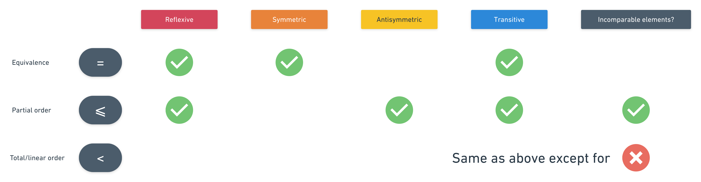
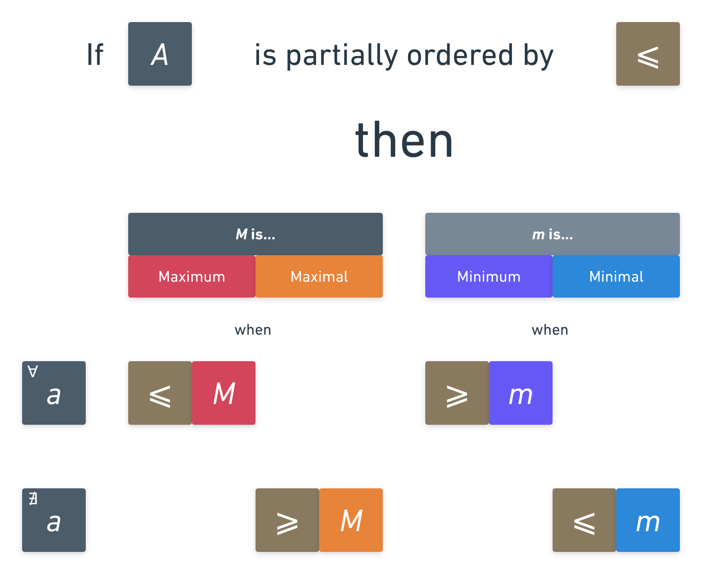
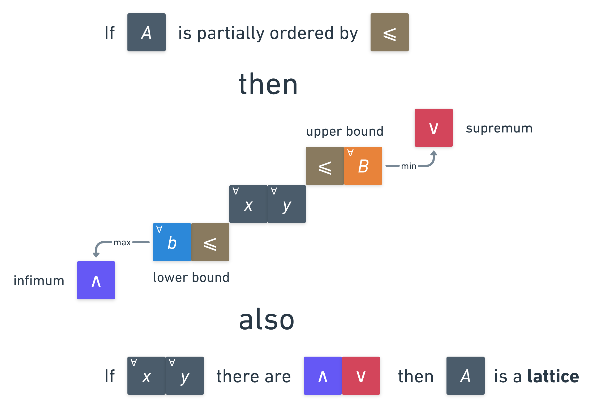
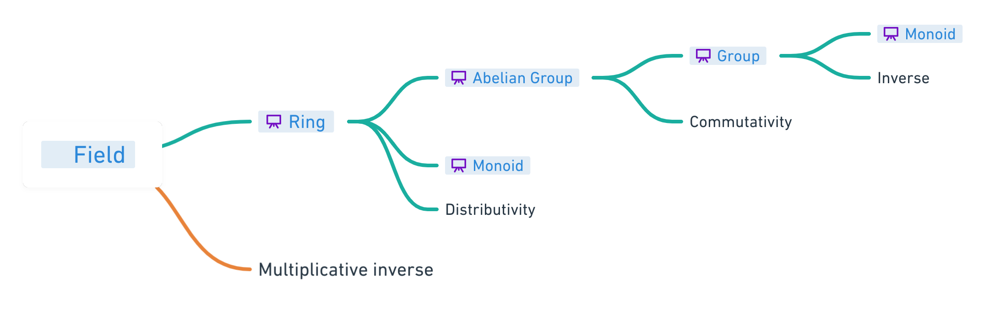
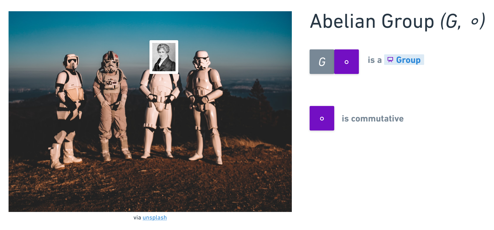
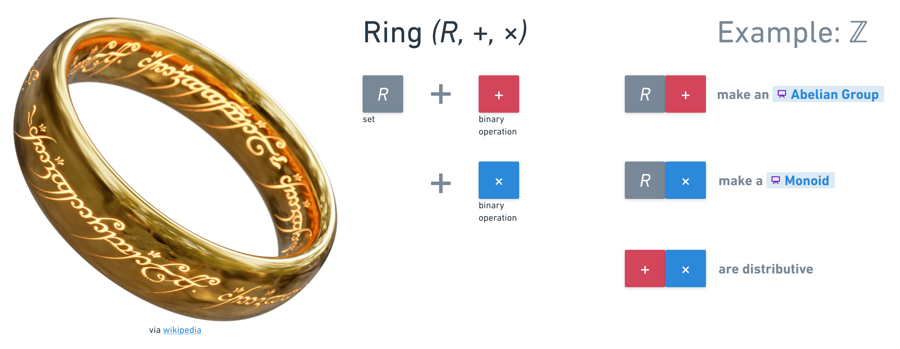

# `CS111` Discrete Mathematics

{{ page.meta.description }}

I have drawn a few cheat sheets / visualizations during the course. Find them below.

## Relations

.

## Functions

.

## Max & Min

.

## Bounds, extremum, & infimum

.

## Cantor's theorem

.

## Algebraic Structures

.

### Abelian Group

### Field

.

### Group

.

### Monoid

.

### Ring

.
