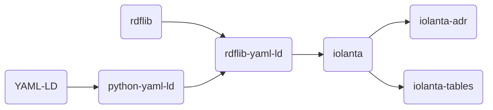

# Projects

## Linked Data

{ align=left width="300" }

 

## Development productivity tools

{ align=left width="300" }

!!! success inline "jeeves"

    Pythonic replacement to :simple-gnu: GNU Make. [jeeves.sh](https://jeeves.sh)

!!! success inline "documented"

    :material-language-python: docstrings with `{self.placeholders}` = user friendly exceptions *sans* boilerplate. [:material-github: `anatoly-scherbakov/documented`](https://github.com/anatoly-scherbakov/documented)

!!! success inline "geopatterns-demo"

    Showcase cloud-native :material-language-python: Python code on :simple-awslambda: AWS Lambda platform with :material-terraform: Hashicorp Terraform. [:material-github: `anatoly-scherbakov/geopatterns-demo`](https://github.com/anatoly-scherbakov/geopatterns-demo/)

!!! quote inline "platonic.tools"

    Represent backends — key-value stores, queues, NoSQL databases — in the form of Python native datastructures. [platonic.tools](https://platonic.tools)

!!! quote inline "ysv"

    :material-language-rust: Rust CLI app for transformations and cleanup of CSV data. [:material-github: `ysv-rs/ysv`](https://github.com/ysv-rs/ysv)

!!! quote inline "vendetta"

    Generate CSV datasets of random data. [:material-github: `anatoly-scherbakov/vendetta`](https://github.com/anatoly-scherbakov/vendetta)

 
