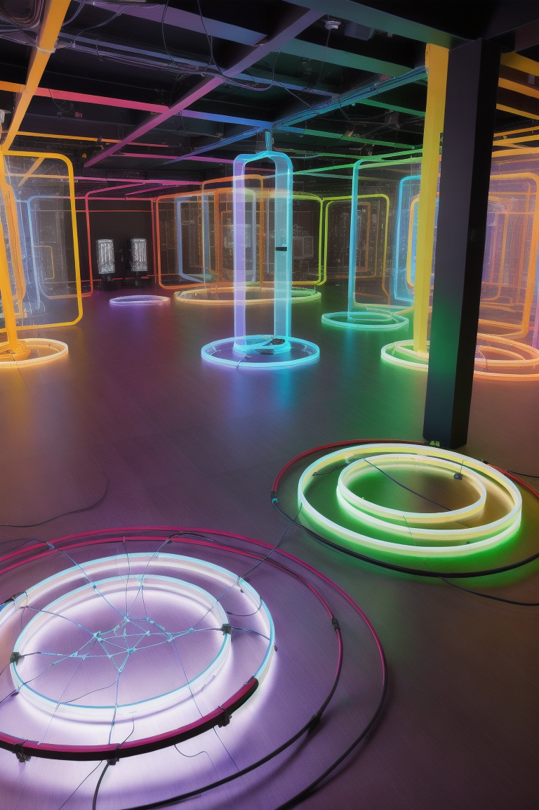
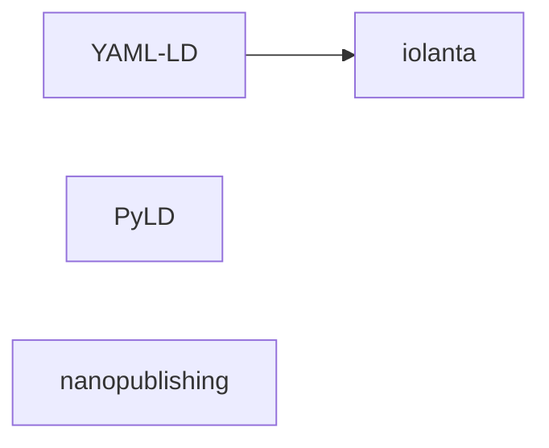

# Projects

## Linked Data

{ align=left width="300" }

```mermaid
graph LR
    yamlld["YAML-LD"] --> iolanta["iolanta"]
    pyld["PyLD"]
    nanopub["nanopublishing"]

    click yamlld "https://www.w3.org/TR/yaml-ld/"
    click iolanta "https://iolanta.tech"
    click pyld "https://github.com/digitalbazaar/pyld"
    click nanopub "https://nanopublishing.iolanta.tech"
```

 

## Development productivity tools

{ align=left width="300" }

!!! success inline "jeeves"

    Pythonic replacement to :simple-gnu: GNU Make. [jeeves.sh](https://jeeves.sh)

!!! success inline "documented"

    :material-language-python: docstrings with `{self.placeholders}` = user friendly exceptions *sans* boilerplate. [:material-github: `anatoly-scherbakov/documented`](https://github.com/anatoly-scherbakov/documented)

 
