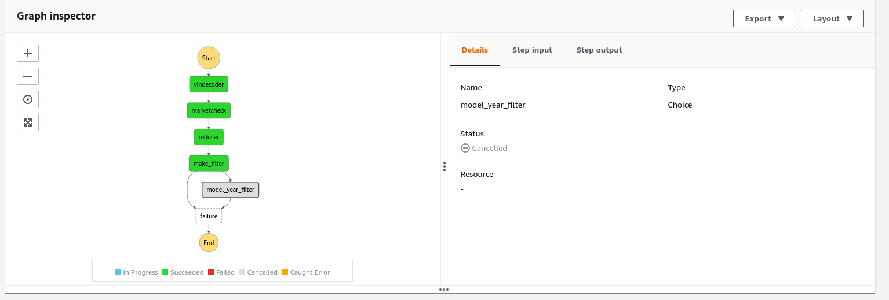

[Step Functions](https://aws.amazon.com/step-functions/) is a [workflow engine](https://github.com/meirwah/awesome-workflow-engines) natively provided by Amazon Web Services. You can create workflows (also known as State Machines) containing sequences of steps connected one to another. Conditions, loops, and error handling are available. You can call AWS Lambda functions and many other services.

<!--more-->

AWS provides a rather pleasant SDK to create and manage workflows from Python:

```shell
pip install stepfunctions
```

Using that SDK, you can write stuff like this:

```python
workflow = Workflow(
    name='test_workflow',
    definition=Chain([
        VINDecoder(),
        Reducer(),
    ]),
    role=role_arn,
)
```

which then can be executed in the cloud and monitored — both via API and visually.

## Problem

`Chain()` construct used above cannot be used with `Choice()`. The reasons are thoroughly described in the [Choice states cannot be chained](https://github.com/aws/aws-step-functions-data-science-sdk-python/issues/31) GitHub thread.

## Solution

My first idea was to rebuild the `Choice` class as follows.

```python
class ChainableChoice(Choice):
    """
    Chainable Choice state.

    If none of the choices match, next step in the chain is used as the default.

    Notice: it is recommended to have `Succeed()` as last step in the chain.
    Otherwise, the last Choice will have no default and the execution will be
    marked as Cancelled instead of Succeeded.

    That is the reason why I am not creating a PR to the official stepfunctions
    SDK repo.
    """

    def next(self, next_step):  # noqa: WPS125
        """Assign the next step to be the default."""
        self.default_choice(next_step)

```

This chain:

```python
Chain([
    VINDecoder(),
    MarketCheck(),
    Reducer(),
    MakeFilter(),
    ModelYearFilter(),
])
```

gives the following:



This happens because the `Chain` class implementation does not call `.next()` on the last item on the chain and, therefore, the `Choice` step does not have a `default_choice`.

To fix this, we need to add this as the end of the chain:

```python
Chain([
    ...,
    Succeed(state_id='success')
])
```

Result:


This makes `Choice`s finally chainable.

## P. S.

I do not see a way to generalize this, that's why I refrained from creating a PR for [stepfunctions](https://github.com/aws/aws-step-functions-data-science-sdk-python/) project.

Overall, kudos to AWS team for creating the tool and Python bindings for it. I feel a workflow engine is an essential commodity for most business oriented applications.